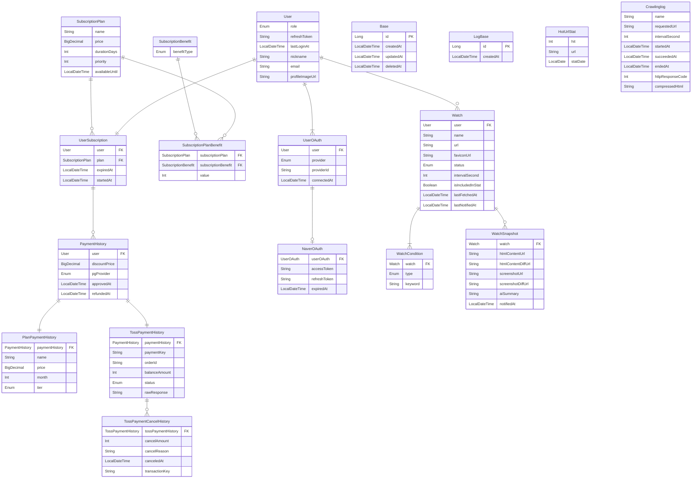

# watchtower
URL을 등록하면 와치타워에서 대신 지켜보다가, 변화가 생기면 바로 알려드립니다!

# ERD

# REST API 명세
## Auth

| Method | URL | 설명 |
| --- | --- | --- |
| GET | `/auth/naver/url` | 네이버 OAuth URL 생성 및 반환 |
| GET | `/auth/naver/callback` | 네이버 OAuth 콜백 처리 및 Watchtower JWT 발급 |
| DELETE | `/auth/naver/revoke` | 네이버 OAuth Token Revocation |
| POST | `/auth/renew` | Watchtower Token 재발급 |
| DELETE | `/auth/logout`  | Watchtower Refresh Token 삭제 |

## Users

| Method | URL | 설명 |
| --- | --- | --- |
| GET | `/users/{userId}` | 프로필 조회 |
| GET | `/users/{userId}/payments`  | 결제 이력 조회 |
| GET | `/users/{userId}/watches` | 와치 목록 조회 |
| PATCH | `/users/{userId}` | 프로필 정보 수정 |
| DELETE | `/users/{userId}` | 회원 탈퇴 (논리삭제 + 네이버 revoke) |
| GET | `/users/{userId}/subscriptions`  | 현재 구독중인 플랜 조회 |
| DELETE | `/users/{userId}/subscriptions`  | 구독 해지 요청(환불) |

## Payments

| Method | URL | 설명 |
| --- | --- | --- |
| GET | `/payments/{paymentId}` | 결제 내역 단건 상세 조회 |
| POST | `/payments/toss/confirm` | 토스 결제 승인 |

## Watches

| Method | URL | 설명 |
| --- | --- | --- |
| POST | `/watches` | 와치 등록 |
| GET | `/watches/{watchId}` | 와치 단건 상세 조회 |
| PATCH | `/watches/{watchId}` | 와치 수정(일시정지/재개 포함) |
| DELETE | `/watches/{watchId}` | 와치 삭제 |
| POST | `/watches/{watchId}/notify` | 테스트 알림 발송 |
| GET | `/watches/{watchId}/conditions` | 와치 조건 목록 조회 |
| POST | `/watches/{watchId}/conditions` | 와치 조건 추가 |
| PATCH | `/watches/{watchId}/conditions/{conditionId}`  | 와치 조건 수정 |
| DELETE | `/watches/{watchId}/conditions/{conditionId}` | 와치 조건 삭제 |
| GET | `/watches/{watchId}/snapshots` | 스냅샷 타임라인 조회 |
| GET | `/watches/{watchId}/snapshots/{snapshotId}` | 스냅샷 단건 상세 조회 |

## Admin

| Method | URL | 설명 |
| --- | --- | --- |
| GET | `/admin/watches/stats` | 대시보드 와치 통계 조회 |
| GET | `/admin/payments/stats` | 대시보드 결제 통계 조회 |
| GET | `/admin/users/stats` | 대시보드 유저수/회원탈퇴수 등 통계 조회 |
| GET | `/admin/auth/stats` | 대시보드 로그인/회원가입 통계 조회 |
| PATCH | `/admin/watches/{watchId}` | 와치 상태 변경(정책 위반 정지 포함) |
| POST | `/admin/payments/{paymentId}/cancel` | 결제 직권 취소 |
| GET | `/admin/payments` | 결제 내역 조회/검색 |
| GET | `/admin/users`  | 전체 유저 조회/검색 |
| PATCH | `/admin/users/{userId}/roles`  | 유저 권한 수정 |
| PATCH | `/admin/users/{userId}/status` | ban/unban 등 유저 상태 변경 |

# 기능적 요구사항

1. **회원**
    - 현재로선 네이버 로그인만 지원하고 자체 회원가입은 지원하지 않음
    - 유료 정책
        - 현재는 Free(와치리스트 최대 10개) 플랜과 Basic(한달에 1000원 와치리스트 최대 20개) 플랜만 존재
        - 기존 플랜 이용자가 동시에 새로운 플랜을 추가로 결제하려는 경우 기존 플랜 가격을 사용한 일수만큼 차감한 후 할인이 적용된 플랜 구매 가능
        - 플랜 기간이 끝나 free 플랜으로 변경될경우 1주일안에 재결제를 하지 않을 시 free 플랜의 범위를 벗어나는 최근에 추가된 와치리스트들이 정지되고 결제 전까지 사용자 임의로 해제 불가
        - 환불 요청시 사용일수를 차감하여 환불

2. **와치리스트(모니터링 URL) 등록**
    - 1년동안 사이트에 로그인을 하지 않으면 등록된 리스트 전부 일시중지됨
    - 접근이 불가능한 주소에 대해선 등록 불가
        - 만약 등록 이후 접근 불가시 일시정지로 변경, 사용자가 재개 버튼을 눌러 접근이 되는것이 확인된 후에 재사용 가능
    - 로그인 해야만 보이는 페이지는 추후 쿠키 제공에 동의한 고객들에 한해서 이용가능
    - 와치리스트 왼쪽엔 다음 항목이 표시된다(무한 스크롤)
        - URL
        - 파비콘
        - 사용자가 설정한 사이트 이름
        - 일시정지 여부(회색과 초록색 점 아이콘으로)
        - 최근 AI 요약
    - 와치리스트 오른쪽엔 처음 들어간 경우 맨 첫번째 아이템이 기본 선택됨
    - 만약 현재 사용자가 등록한 와치리스트가 없다면 등록 요구를 해야함
    - 와치리스트의 오른쪽에는 다음 항목이 표시된다.
        - 위에 표시되었던 정보와 함께
        - 최근 갱신된 시각
        - 일시정지/재개 버튼(재개시 URL 접근 가능여부 체크후 일시정지 풀어야함)
        - 페이지 전체의 타임라인과 변경된 부분만을 시각화하는 타임라인으로 유저가 어떤 부분이 변했는지 알수있도록함
        - 각 타임라인에서 스냅샷들은 최대 일주일간 보관 및 조회가능(S3 요금을 고려해서 추후에 늘리는것 고려)
    - 최소 확인 주기는 5분단위로 5분부터 최대 24시간까지 설정 가능.
        - 만약 동일 URL 을 여러 조건으로 알람을 받고 싶다면 하나의 와치리스트에서 다중 조건을 설정하면됨.
        - 여러 조건에는 현재로선 html 전체 감지와 특정 키워드 등장/소멸 감지가 있음
        - 하나의 와치리스트에는 다중조건이 있는것과는 무관하게 하나의 확인주기만 존재함(예: a.com/abc 에 대한 조건이 3개 있더라도 모두 확인 주기는 동일함)
        - 중복조건은 최대 3개까지 등록가능
3. **현재 Hot 한 와치리스트**
    - 네이버 실시간 검색어처럼 변화수를 기준으로 현재 핫한 URL 을 일단위 집계하여 10개까지 나열
    - URL 을 클릭해서 들어갈수있음
    - 노출된다는 거부감이 들지 않도록 도메인까지만(a.com) 표기
    - 통계 집계를 원하지 않는 고객은 해당 와치리스트 생성시에만 끄기 가능
4. **와치리스트 변화 알림**
    - 현재로선 디스코드와 텔레그램만 지원(카카오톡, 메일같은 비용드는건 이후에 고려)
    - 최초 크롤링은 스냅샷만 저장하고 알림은 없음
    - 와치리스트에는 알림 수신 테스트 기능이 있어야함 Uptime Kuma 같이
    - 알림내용엔 다음이 포함되어있어야함
        - 사용자가 설정한 사이트 이름
        - URL
        - 방금 발생한 변화에 대한 AI 요약
        - 이전 스냅샷과 달라진 부분만 강조

# 비기능적 요구사항
1. **인증**
    - 서버 수평확장시 redis 사용을 하지 않기위해(관리포인트/비용 절감) JWT 사용
2. **와치리스트 등록**
    - 접근할 수 없는 주소를 판단하는 기준
        - 400번대 에러
        - 빈페이지
        - Cloudflare challenge(추후에 우회법을 찾아야함)
        - 등등...(추후에 추가)
    - js 렌더링을 해야 나타나는 컨텐츠도 있으니 Playwright 같은걸 써야함
        - 스프링과는 별개로 SQS 태워서 메시지 수 기준으로 오토 스케일링 고려
    - 쿠키는 document.cookie 를 사용자가 치게 만들거나, 브라우저 익스텐션 만들거나 등 방법을 고려
3. **현재 Hot 한 와치리스트**
    - 카운팅은 경합이 크지 않을것으로 예상되기 때문에 낙관락으로 3회 지수 백오프+jitter로 리트라이하고 그래도 실패시 슬랙에 로그 남기기
    - 심하면 비관락 또는 각 row 에서 업데이트 치고 통계 테이블 따로 만드는 등등등 다른 전략 고려
4. **변화 감지 프로세스**
    - HTML 스냅샷 생성 → 이전 스냅샷과 diff
    - 변화 없으면 종료
    - 변화 있으면 순서대로 실행
        1. 변화 전/후 스크린샷 촬영
        2. OpenCV로 변화 영역 빨간 네모 강조
        3. 토큰을 아끼기위해 이전 html 과 신규 html 간의 diff 를 생성하고 llm 에 전달
        4. 알림 전송
    - 요청후 1분이내 응답 없을시 실패로 간주하고 지수 백오프로 3번까지 재시도(접근할 수 없는 사이트는 사전에 걸러지므로 여기선 일시적인 네트워크/서버 오류일 가능성)
    - 모든 요청 실패하면 사이트에 문제가 생겼다는 알람보낸뒤 감지 정지 처리함
5. **알림**
    - 알림 전송 실패 시 백오프+jitter(폭주 방지)로 최대 10회까지 재시도후 내 슬랙으로 알림(긴급. 외부쪽 장애일 가능성이 있음)
6. **그외**
    - 모든 엔티티는 논리삭제로 처리
    - 무중단 배포(GitHub Action + aws로드 밸런서 고려)
    - graceful shutdown 으로 모든 connection drain하고 중단
    - 스키마 업데이트를 하더라도 알람, 결제서비스는 끊기면 안되므로 SQS에 넣어서 관리
    - 모니터링이랑 백업 고려
